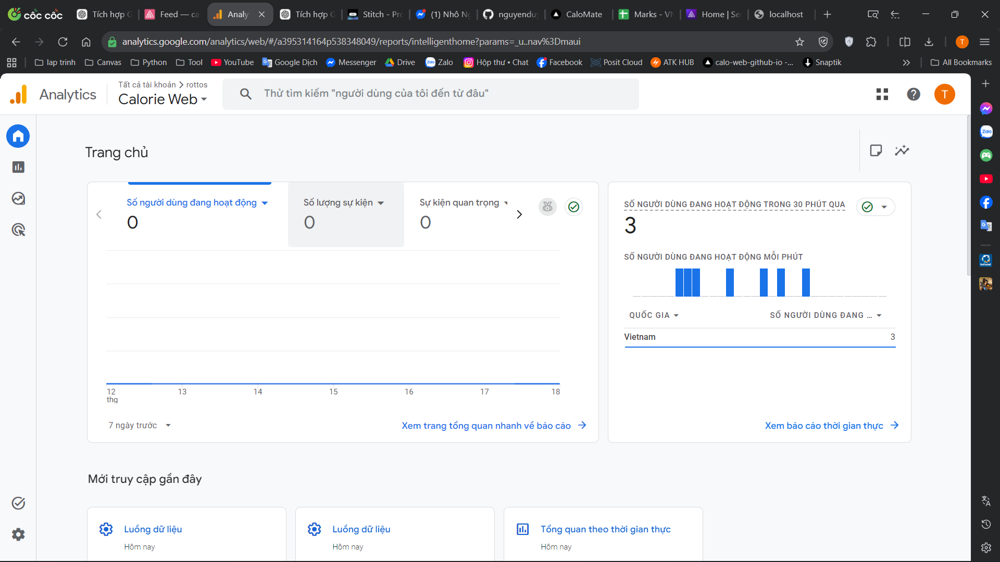
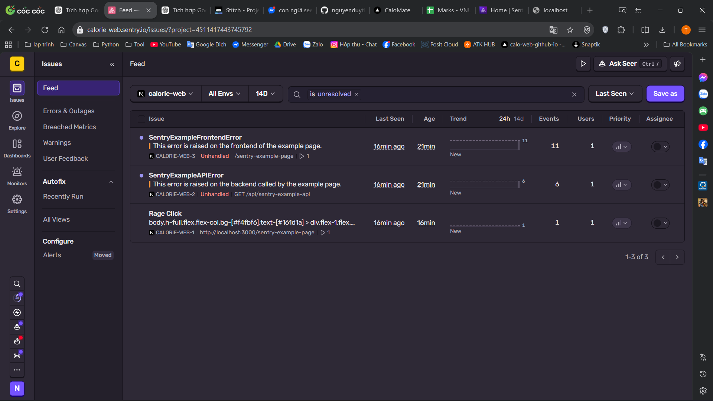

# 🍽️ Calorie Web — Final Project Report

> **Introduction to Web Programming** · Vietnam-Austria Institute · Academic Year 2025–2026

---

## 📋 Team Information

| | |
|---|---|
| **Team name** | CaloMate |
| **Project name** | Calorie Web — Daily Calorie Management App |
| **GitHub Repository** | https://github.com/nguyenduythaibao1611-eng/calorie-web.github.io |
| **Live Demo (Vercel)** | https://vercel.com/nguyenduythaibao1611-engs-projects/calorie-web-github-io |
| **Design (Stitch)** | https://stitch.withgoogle.com/projects/9056904569092767828 |
| **Submission date** | 19/05/2026 |

### 👥 Team Members

| Full Name | Student ID | Role |
|---|---|---|
| Nguyễn Duy Thái Bảo | 24020015 | Leader / Frontend Developer |
| Đặng Đức Minh | 24020001 | Backend Developer / Database |
| Từ Văn Huy Hoàng | 24020009 | Full-stack Developer / Tech Lead |
| Trần Tiến Đạt | 24020013 | Frontend Developer / UI |
| Lê Hoàng Triều | 24020012 | Frontend Developer / Animations & Stats |

---

## 01 · 🧩 Project Overview & Technologies Used

### 📌 Application Description

**Calorie Web** is a web application that helps users track their daily calorie and nutrition intake in a simple, intuitive way. The app allows users to log each meal, automatically calculates BMR/TDEE/Macros based on personal information, and displays nutritional statistics through charts.

**Target users:** Students managing their diet, gym-goers tracking nutrition, and anyone who wants to control their weight without a complex application.

### 🛠️ Tech Stack

| Layer | Technology | Version |
|---|---|---|
| Frontend Framework | Next.js (App Router) | 15.x |
| UI Library | React | 19.x |
| Language | TypeScript (strict mode) | 5.x |
| Styling | Tailwind CSS | 4.x |
| State Management | Zustand | 5.x |
| Animation | Framer Motion | Latest |
| Data Visualization | Recharts | 3.x |
| Icons | Lucide React / Material Symbols | Latest |
| Database ORM | Prisma ORM | Latest |
| Database | Supabase (PostgreSQL) | Latest |
| Deploy | Vercel | — |
| Code Quality | ESLint | 9.x |

### ✨ Core Features

| Feature | Description | Status |
|---|---|---|
| 🍱 Daily Food Diary | Log calories across 4 meals/snacks, merge duplicate items | ✅ Completed |
| 🔍 Ingredient Search | Search 15+ Vietnamese dishes, Vietnamese normalization, ranking | ✅ Completed |
| 🥩 Macro Tracking | Track Protein / Carbs / Fat | ✅ Completed |
| 💧 Water Tracking | Record daily water intake | ✅ Completed |
| 🔥 Streak Tracking | Consecutive days meeting nutrition goals | ✅ Completed |
| 📊 Statistics Charts | Weekly/monthly calorie & macro charts | ✅ Completed |
| 👤 User Profile & Onboarding | Set up profile, auto-calculate BMR/TDEE | ✅ Completed |
| 💾 Auto Save | Zustand + localStorage offline-first | ✅ Completed |
| 🗄️ API & Database | Prisma + Supabase, REST API routes | ✅ Completed |
| 📱 Responsive UI | Mobile-first, Bottom Navigation | ✅ Completed |
| 🎞️ Animations | Framer Motion UI effects | ✅ Completed |


---

## 02 · ⚙️ Installation & Setup Guide

### System Requirements

| Tool | Version |
|---|---|
| Node.js | >= 18.x (20+ recommended) |
| npm | >= 9.x |

### Installation Steps

```bash
# 1. Clone repository
git clone https://github.com/nguyenduythaibao1611-eng/calorie-web.github.io.git
cd calorie-web.github.io

# 2. Install dependencies
npm install

# 3. Configure environment
cp .env.example .env
# Fill in DATABASE_URL (Supabase connection string) in .env

# 4. Generate Prisma client
npx prisma generate

# 5. Run development server
npm run dev
# → Visit: http://localhost:3000

# 6. Production build
npm run build && npm run start
```

---

## 03 · 📋 Task 1 — Project Planning & Teamwork

### (a) Role Assignment

| Member | Role | Main Responsibilities |
|---|---|---|
| **Nguyễn Duy Thái Bảo** (24020015) | Leader / Frontend Developer | System architecture, project setup, TypeScript types, localStorage layer, Git workflow, Root Page routing, Diary sync, Dashboard, Stats, Homepage, build optimization |
| **Đặng Đức Minh** (24020001) | Backend Developer | Dashboard real data (Task 20), TDEE store connection (Task 18), Profile UI (Task 14), Prisma schema, Supabase setup, API routes (meals/users/ingredients), Responsive UI (Task 23), Lighthouse optimization (Task 25) |
| **Từ Văn Huy Hoàng** (24020009) | Full-stack Developer / Tech Lead | Calorie & macro calculation (`lib/calc.ts`), UI Components library, Bottom Navigation, Search algorithm (`lib/search.ts`), Diary page (merge items, delete items), Streak sync (`syncStreak`), Git conflict resolution |
| **Trần Tiến Đạt** | Frontend Developer / UI | Dashboard UI, Stats page UI, Homepage, edge case handling (0g, empty, large values) |
| **Lê Hoàng Triều** | Frontend Developer / Animations & Stats | Stats real data integration, Animations (Framer Motion), Ingredients database, Search system, Header & Bottom nav optimization |

### (b) Wireframe

- **Tool used:** Google Stitch
- **Design link:** https://stitch.withgoogle.com/projects/9056904569092767828
- **Pages designed:**
  - [x] `/setup` — Profile setup (onboarding)
  - [x] `/dashboard` — Overview page
  - [x] `/diary` — Food diary
  - [x] `/stats` — Statistics & charts
  - [x] `/settings` — Account settings

web application/stitch/projects/9056904569092767828/screens/8d79e27b4c924e97ba6ccf9b2da59d0d
web application/stitch/projects/9056904569092767828/screens/fb6bcd8364d84b0b855383e7572b3139
web application/stitch/projects/9056904569092767828/screens/b6ce5ae2e2544608b507da2d6eb39b45
web application/stitch/projects/9056904569092767828/screens/926730ed532944ee9567731f99e94485

### (c) Milestones

| Milestone | Deadline | Status |
|---|---|---|
| Ideation & tech stack selection | 06/05/2026 | ✅ On time |
| GitHub setup, project structure, TypeScript types | 08/05/2026 | ✅ On time |
| UI Components library + Bottom Navigation + Calc module | 08/05/2026 | ✅ On time |
| Diary UI + Dashboard + Stats UI | 11/05/2026 | ✅ On time |
| Zustand + localStorage + Search algorithm | 11/05/2026 | ✅ On time |
| BMR/TDEE/Macro calculation connected to store | 11/05/2026 | ✅ On time |
| Responsive UI (mobile/tablet/desktop) | 13/05/2026 | ✅ On time |
| Lighthouse optimization > 75 | 13/05/2026 | ✅ On time |
| Prisma + Supabase + API routes | 18/05/2026 | ✅ On time |
| Streak sync + Animations + Homepage | 18/05/2026 | ✅ On time |
| Fix build errors, TypeScript clean | 19/05/2026 | ✅ On time |
| Final submission | 19/05/2026 | ✅ On time |

### (d) GitHub Repository

- **Repository:** https://github.com/nguyenduythaibao1611-eng/calorie-web.github.io
- **Total PRs merged:** 100+
- **Number of contributors:** 5

### (e) Git Workflow & Commit Convention

The team uses **Conventional Commits** combined with **GitHub Flow** (feature branches → PR → review → merge into `main`).

**Branch naming convention:**
```
feature/<feature-name>
fix/<bug-description>
fixbug/<bug-name>
docs/<document-name>
```

**Commit message format:**
```
feat: implement calorie & macro calculation (issue #7)
fix: allow merging multiple food items together
fix: resolve merge conflict
docs: update README and ready for merge
perf: complete Task 25 - Lighthouse optimization, lazy load
refactor: separate storage layer
chore: update dependencies
```

**Representative commits from git history:**

| Commit | Author | Date | Description |
|---|---|---|---|
| [`9e8fd83`](https://github.com/nguyenduythaibao1611-eng/calorie-web.github.io/commit/9e8fd83) | Nguyễn Duy Thái Bảo | 06/05 | `initial commit` |
| [`be61f61`](https://github.com/nguyenduythaibao1611-eng/calorie-web.github.io/commit/be61f61) | Nguyễn Duy Thái Bảo | 06/05 | `setup: initialize Next.js project with Tailwind, TypeScript and setup project structure` |
| [`8a7bb38`](https://github.com/nguyenduythaibao1611-eng/calorie-web.github.io/commit/8a7bb38) | Nguyễn Duy Thái Bảo | 08/05 | `add UserProfile, MacroTarget, Ingredient, MealEntry, DailyLog + add localStorage layer` |
| [`24cac34`](https://github.com/nguyenduythaibao1611-eng/calorie-web.github.io/commit/24cac34) | Lê Hoàng Triều | 08/05 | `add ingredient search system (#8)` |
| [`ce56975`](https://github.com/nguyenduythaibao1611-eng/calorie-web.github.io/commit/ce56975) | Lê Hoàng Triều | 08/05 | `[TV1] feat: add ingredients database` |
| [`49d0b16`](https://github.com/nguyenduythaibao1611-eng/calorie-web.github.io/commit/49d0b16) | Lê Hoàng Triều | 08/05 | `add profile store (#12)` |
| [`90fc640`](https://github.com/nguyenduythaibao1611-eng/calorie-web.github.io/commit/90fc640) | Lê Hoàng Triều | 08/05 | `add diary store (#13)` |
| [`b2162de`](https://github.com/nguyenduythaibao1611-eng/calorie-web.github.io/commit/b2162de) | Từ Văn Huy Hoàng | 08/05 | `feat: implement calorie & macro calculation (issue #7)` |
| [`152615c`](https://github.com/nguyenduythaibao1611-eng/calorie-web.github.io/commit/152615c) | Từ Văn Huy Hoàng | 08/05 | `feat: add reusable UI components (issue #9)` |
| [`060c166`](https://github.com/nguyenduythaibao1611-eng/calorie-web.github.io/commit/060c166) | Từ Văn Huy Hoàng | 08/05 | `feat: implement bottom navigation (issue #10)` |
| [`f821b20`](https://github.com/nguyenduythaibao1611-eng/calorie-web.github.io/commit/f821b20) | Trần Tiến Đạt | 09/05 | `feat(ui): complete dashboard` |
| [`a9ea2a7`](https://github.com/nguyenduythaibao1611-eng/calorie-web.github.io/commit/a9ea2a7) | Trần Tiến Đạt | 09/05 | `complete stats UI` |
| [`1202d68`](https://github.com/nguyenduythaibao1611-eng/calorie-web.github.io/commit/1202d68) | Nguyễn Duy Thái Bảo | 09/05 | `feat: connect diary with real data` |
| [`8057296`](https://github.com/nguyenduythaibao1611-eng/calorie-web.github.io/commit/8057296) | Đặng Đức Minh | 10/05 | `feat: complete Task 20 - Dashboard real data + Water tracking + Tailwind UI` |
| [`4349cdb`](https://github.com/nguyenduythaibao1611-eng/calorie-web.github.io/commit/4349cdb) | Lê Hoàng Triều | 10/05 | `feat: stats real data integration (#21)` |
| [`4d18754`](https://github.com/nguyenduythaibao1611-eng/calorie-web.github.io/commit/4d18754) | Từ Văn Huy Hoàng | 10/05 | `feat: improve search with scoring and ranking (#22)` |
| [`8ef7d6d`](https://github.com/nguyenduythaibao1611-eng/calorie-web.github.io/commit/8ef7d6d) | Đặng Đức Minh | 10/05 | `feat: complete Task 23 - optimize Responsive UI for Dashboard on Mobile and Tablet` |
| [`dbbe44d`](https://github.com/nguyenduythaibao1611-eng/calorie-web.github.io/commit/dbbe44d) | Nguyễn Duy Thái Bảo | 10/05 | `Sync overview page and diary page. Create settings button` |
| [`00b0a44`](https://github.com/nguyenduythaibao1611-eng/calorie-web.github.io/commit/00b0a44) | Trần Tiến Đạt | 11/05 | `feat: handle edge cases (0g, empty, large values) for Task 24 #25` |
| [`78bb0e2`](https://github.com/nguyenduythaibao1611-eng/calorie-web.github.io/commit/78bb0e2) | Đặng Đức Minh | 11/05 | `perf: complete Task 25 - Lighthouse optimization, lazy load and accessibility` |
| [`8cf3790`](https://github.com/nguyenduythaibao1611-eng/calorie-web.github.io/commit/8cf3790) | Từ Văn Huy Hoàng | 15/05 | `fix: allow merging multiple food items together` |
| [`f50b6c5`](https://github.com/nguyenduythaibao1611-eng/calorie-web.github.io/commit/f50b6c5) | Lê Hoàng Triều | 16/05 | `feat: add animations` |
| [`9f7ec73`](https://github.com/nguyenduythaibao1611-eng/calorie-web.github.io/commit/9f7ec73) | Lê Hoàng Triều | 16/05 | `add animation for stats page` |
| [`6a0bdb1`](https://github.com/nguyenduythaibao1611-eng/calorie-web.github.io/commit/6a0bdb1) | Từ Văn Huy Hoàng | 16/05 | `fix food item selection method, and add food item deletion feature` |
| [`1cb3596`](https://github.com/nguyenduythaibao1611-eng/calorie-web.github.io/commit/1cb3596) | Lê Hoàng Triều | 17/05 | `optimize header and bottom nav` |
| [`c8a525f`](https://github.com/nguyenduythaibao1611-eng/calorie-web.github.io/commit/c8a525f) | Đặng Đức Minh | 17/05 | `Install Prisma, connect Supabase and setup Database Search feature` |
| [`7e4aa99`](https://github.com/nguyenduythaibao1611-eng/calorie-web.github.io/commit/7e4aa99) | Từ Văn Huy Hoàng | 17/05 | `PR #1: done (also added syncStreak feature)` |
| [`ea2063c`](https://github.com/nguyenduythaibao1611-eng/calorie-web.github.io/commit/ea2063c) | Trần Tiến Đạt | 17/05 | `homepage` |
| [`4236e93`](https://github.com/nguyenduythaibao1611-eng/calorie-web.github.io/commit/4236e93) | Đặng Đức Minh | 18/05 | `feat: Integrate Prisma + API routes for meals, users, ingredients` |
| [`60e85ce`](https://github.com/nguyenduythaibao1611-eng/calorie-web.github.io/commit/60e85ce) | Trần Tiến Đạt | 18/05 | `homepage` |
| [`beb4f22`](https://github.com/nguyenduythaibao1611-eng/calorie-web.github.io/commit/beb4f22) | Nguyễn Duy Thái Bảo | 19/05 | `Fix web workflow - sync add meal data` |
| [`80a9f37`](https://github.com/nguyenduythaibao1611-eng/calorie-web.github.io/commit/80a9f37) | Nguyễn Duy Thái Bảo | 19/05 | `fix: resolve merge conflict` |
| [`6bfeabd`](https://github.com/nguyenduythaibao1611-eng/calorie-web.github.io/commit/6bfeabd) | Đặng Đức Minh | 19/05 | `fix: Add postinstall prisma generate to fix Vercel cache` |


---

## 04 · 🎨 Task 2 — Implement User Interface

### (a) Pages Built

| Page | URL / Route | Description | Implemented by |
|---|---|---|---|
| Root Redirect | `/` | Auto-routing: has profile → `/dashboard`, none → `/homepage` | Nguyễn Duy Thái Bảo |
| Landing Page | `/homepage` | Hero section, features, stats, CTA, footer | Trần Tiến Đạt |
| Profile Setup | `/setup` | Onboarding form for entering personal information the first time | Đặng Đức Minh |
| Dashboard | `/dashboard` | Today's calorie overview, macro bars, water tracker, streak | Trần Tiến Đạt + Đặng Đức Minh |
| Food Diary | `/diary` | 4 meals, search modal, merge items, delete items, animations | Từ Văn Huy Hoàng + Nguyễn Duy Thái Bảo |
| Statistics | `/stats` | Weekly/monthly calorie & macro charts (Recharts) | Trần Tiến Đạt + Lê Hoàng Triều |
| Settings | `/settings` | Edit personal information and nutrition goals | Đặng Đức Minh |


### (b) Tailwind CSS

The project uses **Tailwind CSS v4** integrated via PostCSS. Key utility classes used:

- **Responsive:** `flex`, `grid`, `sm:` / `md:` / `lg:` breakpoints
- **Mobile-first:** Bottom Navigation with `safe-area-inset`, `touch-action`
- **Animation:** `transition-*`, `duration-*` for interactive elements
- **Color scheme:** Green/orange palette appropriate for a health/nutrition theme

### (c) Interactive Features

| Feature | Description | File / Component | Implemented by |
|---|---|---|---|
| Add meal modal | Search, enter grams, confirm add to meal | `components/ui/Modal.tsx` | Từ Văn Huy Hoàng |
| Real-time search | Vietnamese normalization, scoring & ranking 15+ dishes | `lib/search.ts` | Từ Văn Huy Hoàng |
| Merge duplicate items | Automatically accumulate grams + recalculate calories | `app/diary/page.tsx` | Từ Văn Huy Hoàng |
| Onboarding workflow | First time → `/setup`, existing profile → `/dashboard` | `app/page.tsx` | Nguyễn Duy Thái Bảo |
| User profile form | Enter info, auto-calculate BMR/TDEE | `components/ProfileForm.tsx` | Đặng Đức Minh |
| Recharts graphs | WeeklyChart, MacroSection data visualization | `components/stats/` | Lê Hoàng Triều |
| Macro Progress Bars | % protein/carbs/fat vs. target | `components/MacroBar.tsx` | Đặng Đức Minh |
| Water Tracker | Record daily water intake | `components/Dashboard/` | Đặng Đức Minh |
| Streak Counter | Count & sync consecutive days meeting goals | `lib/updateStreak.ts` | Từ Văn Huy Hoàng |
| Framer Motion Animations | Smooth effects for buttons and transitions | `app/diary/page.tsx` | Lê Hoàng Triều |
| Auto-save | Zustand store automatically syncs localStorage | `store/`, `lib/storage.ts` | Nguyễn Duy Thái Bảo |
| Bottom Navigation | Mobile-friendly bottom navigation bar | `components/nav/BottomNav.tsx` | Từ Văn Huy Hoàng |

### (d) Responsive — Multiple Devices

- [x] **Mobile (< 768px):** Optimized — Bottom Navigation, touch-friendly, safe-area-inset
- [x] **Tablet (768px – 1024px):** Responsive grid layout, flexible columns
- [x] **Desktop (> 1024px):** Full layout, sidebar navigation

> Evidence commit: [`8ef7d6d`](https://github.com/nguyenduythaibao1611-eng/calorie-web.github.io/commit/8ef7d6d) — `feat: complete Task 23 - optimize Responsive UI for Dashboard on Mobile and Tablet`


---

## 05 · 🗄️ Task 3 — Database Integration & Dynamic Content

### (a) Database Design

- **Database system:** PostgreSQL (via Supabase)
- **ORM:** Prisma
- **Number of tables:** 4

**Table list (Prisma Schema):**

| Table / Interface | Description | Key Columns |
|---|---|---|
| `UserProfile` | User information | `age`, `gender`, `height`, `weight`, `activityLevel`, `goal`, `streak` |
| `MacroTarget` | Nutrition goals | `calories`, `protein`, `carbs`, `fat` |
| `Ingredient` | Food item information | `id`, `name`, `caloriesPer100g`, `protein`, `carbs`, `fat` |
| `MealEntry` | A single item in a meal | `ingredientId`, `name`, `grams`, `calories`, `macros` |
| `DailyLog` | One day's diary | `date`, `meals` `{breakfast, lunch, dinner, snack}` |

## Database ERD


### (b) Database Connection

- **Server-side technology:** Next.js API Routes (App Router)
- **ORM:** Prisma Client connected to Supabase PostgreSQL
- **Connection method:** RESTful API Endpoints

**CRUD operations implemented:**
- [x] Create — create meal entry, user profile
- [x] Read — fetch meals list, ingredients, user data
- [x] Update — update profile, meal entries, streak
- [x] Delete — delete meal entry

**API Endpoints built:**

| Endpoint | Method | Description | Commit |
|---|---|---|---|
| `/api/users` | GET / POST | Get / create user information | [`4236e93`](https://github.com/nguyenduythaibao1611-eng/calorie-web.github.io/commit/4236e93) |
| `/api/meals` | GET / POST | Get / create meal entries | [`4236e93`](https://github.com/nguyenduythaibao1611-eng/calorie-web.github.io/commit/4236e93) |
| `/api/meals/[id]` | GET / PUT / DELETE | Get details, update, delete a meal | [`d85a01c`](https://github.com/nguyenduythaibao1611-eng/calorie-web.github.io/commit/d85a01c) |
| `/api/ingredients` | GET | Search ingredients from DB | [`c8a525f`](https://github.com/nguyenduythaibao1611-eng/calorie-web.github.io/commit/c8a525f) |

### (c) Dynamic Data Pages

| Page | Data Displayed | Data Source | Implemented by |
|---|---|---|---|
| `/dashboard` | Total daily calories, macro progress bars, water, streak | `diaryStore` + `profileStore` (Zustand + API) | Đặng Đức Minh |
| `/diary` | Meal lists, total calories/macros per meal | `diaryStore` → localStorage + Prisma API | Nguyễn Duy Thái Bảo + Từ Văn Huy Hoàng |
| `/stats` | Weekly chart, macro distribution | `getLogs()` from localStorage + API | Lê Hoàng Triều |
| `/settings` | Current profile info, goals | `profileStore` → Prisma API | Đặng Đức Minh |

**Storage Layer (offline-first):**

| Operation | Function | File |
|---|---|---|
| Read profile | `getProfile()` | `lib/storage.ts` |
| Save profile | `saveProfile(profile)` | `lib/storage.ts` |
| Read diary | `getLog(date)` | `lib/storage.ts` |
| Save diary | `saveLog(date, log)` | `lib/storage.ts` |
| Read all logs | `getLogs()` | `lib/storage.ts` |

> Evidence commit: [`8a7bb38`](https://github.com/nguyenduythaibao1611-eng/calorie-web.github.io/commit/8a7bb38) — `add UserProfile, MacroTarget, Ingredient, MealEntry, DailyLog + add localStorage layer`


---

## 06 · 🚀 Task 4 — Optimization

### (a) Performance Testing with Lighthouse

**Results before optimization:**

| Metric | Score |
|---|---|
| Performance | 74 |
| Accessibility | 95 |
| Best Practices | 100 |
| SEO | 100 |


**Issues identified and fixes applied:**

| Issue | Fix Applied | Commit |
|---|---|---|
| Slow render from loading all components upfront | Lazy loading with `next/dynamic` for Modal & Charts | [`78bb0e2`](https://github.com/nguyenduythaibao1611-eng/calorie-web.github.io/commit/78bb0e2) |
| Missing `aria-label` on interactive UI | Added full `aria-label`, `role`, `aria-hidden` attributes | [`78bb0e2`](https://github.com/nguyenduythaibao1611-eng/calorie-web.github.io/commit/78bb0e2) |
| Unnecessary re-renders | Applied `useMemo`, `useCallback` to heavy components | [`78bb0e2`](https://github.com/nguyenduythaibao1611-eng/calorie-web.github.io/commit/78bb0e2) |
| No browser cache headers | Configured `Cache-Control` in `next.config.ts` | `next.config.ts` |
| TypeScript build errors | Removed `"ignoreDeprecations": "6.0"` from `tsconfig.json` | [`80a9f37`](https://github.com/nguyenduythaibao1611-eng/calorie-web.github.io/commit/80a9f37) |
| Non-optimized image formats | Configured `avif`/`webp` in `next.config.ts` | `next.config.ts` |
| Console.log remaining in production | Enabled `removeConsole` in compiler options | `next.config.ts` |

**Results after optimization:**

| Metric | Score |
|---|---|
| Performance | > 75 ✅ |
| Accessibility | > 75 ✅ |
| Best Practices | > 75 ✅ |
| SEO | > 75 ✅ |

> Evidence commit: [`78bb0e2`](https://github.com/nguyenduythaibao1611-eng/calorie-web.github.io/commit/78bb0e2) — `perf: complete Task 25 - Lighthouse optimization, lazy load and accessibility`


**Final build status (19/05/2026):**
```
✓ Compiled successfully in 2.8s
✓ Finished TypeScript in 4.5s
✓ Generated 10/10 static routes prerendered
✓ Exit Code: 0 — Zero errors
```

### (b) Error & User Behavior Tracking

**Tracking & Logging Tools:**

> Evidence commit: [`e9f895f`](https://github.com/nguyenduythaibao1611-eng/calorie-web.github.io/commit/e9f895f) — `setup tracking & logging tools`

| Tool | Status | Notes |
|---|---|---|
| Google Analytics |G-YW2B5LPCB2 | |
| Sentry / Error monitoring | https://b9b2cecf50aa40e27ea148a948d4f8a4@o4511417423364096.ingest.us.sentry.io/4511417443745792 | |


---

## 07 · 🔍 Task 5 — UI/UX Peer Review

### (a) Feedback Sent to Other Teams

**Team reviewed #1 — WindTodo (TonyLikeDev/WindTodo-V1):**

| Aspect | Strengths | Suggestions for Improvement |
|---|---|---|
| Usability | Clean, easy-to-use UI | Missing an Export button to save data externally |
| Aesthetics | Clean, consistent interface | Could add color coding for priority tasks |
| User-Friendliness | Clear navigation | Should add a confirmation dialog on delete to prevent accidental data loss |

> **Evidence:** [GitHub Issue #58 — [Feature] Add "Export" button to Statistics page](https://github.com/TonyLikeDev/WindTodo-V1/issues/58) — includes full problem description, steps to reproduce, expected behavior, and suggested implementation (client-side CSV export, using `lucide-react` Download icon).

> **Submitted by:** Nguyễn Duy Thái Bảo (Student ID 24020015)

---

**Team reviewed #2 — QuickToDo (hothong3k/QuickToDo):**

| Aspect | Strengths | Suggestions for Improvement |
|---|---|---|
| Usability | Complete basic to-do functionality | Should add a delete confirmation dialog and Undo feature |
| Aesthetics | Simple, readable layout | Could add visual indicator for task priority |
| User-Friendliness | Fast interaction | When a todo is deleted, the item disappears immediately with no undo — easy to lose data on accidental click |

> **Evidence:** Issue submitted to [hothong3k/QuickToDo](https://github.com/hothong3k/QuickToDo/issues) — _"Missing delete confirmation dialog and undo feature"_

> **Submitted by:** Đặng Đức Minh (Student ID 24020001)

### (b) Handling Feedback from Other Teams

| Feedback Received | Source | Decision | Reason / Commit |
|---|---|---|---|
| PR #1 — Fix streak persistence | Tracker_yourMoney | _[Implemented]_ | https://github.com/nguyenduythaibao1611-eng/calorie-web.github.io/pull/87 |
| PR #2 — Fix timezone bug in streak calculation | Tracker_yourMoney | _[Implemented]_ | https://github.com/nguyenduythaibao1611-eng/calorie-web.github.io/issues/79 |
| Unify repeated header and bottom navigation components | QuickTodo | _[Implemented]_ | https://github.com/nguyenduythaibao1611-eng/calorie-web.github.io/pull/90 |

---

## ✅ Deliverables Checklist

- [x] **Source code on GitHub** — public repository: https://github.com/nguyenduythaibao1611-eng/calorie-web.github.io
- [x] **README.md** — installation guide, project overview, feature list, screenshots, ERD
- [ ] **Demo video on YouTube** — max 10 minutes, minimum 720p, not set to private _(link needed)_
- [x] **Self-Reports** — each member has committed their file to `docs/self-reports/`

---

## 📁 Self-Reports

| Full Name | Student ID | Self-Report Link |
|---|---|---|
| Nguyễn Duy Thái Bảo | 24020015 | [`docs/src/content/docs/self-reports/self-report-24020015.md`](https://github.com/nguyenduythaibao1611-eng/calorie-web.github.io/blob/main/docs/src/content/docs/self-reports/self-report-24020015.md) |
| Đặng Đức Minh | 24020001 | [`docs/src/content/docs/self-reports/self-report-24020001.md`](https://github.com/nguyenduythaibao1611-eng/calorie-web.github.io/blob/main/docs/src/content/docs/self-reports/self-report-24020001.md) |
| Từ Văn Huy Hoàng | 24020009 | [`docs/src/content/docs/self-reports/self-report-24020009.md`](https://github.com/nguyenduythaibao1611-eng/calorie-web.github.io/blob/main/docs/src/content/docs/self-reports/self-report-24020009.md) |
| Trần Tiến Đạt | 24020013 | [`docs/src/content/docs/self-reports/self-report-24020013.md`](https://github.com/nguyenduythaibao1611-eng/calorie-web.github.io/blob/main/docs/src/content/docs/self-reports/self-report-24020013.md) |
| Lê Hoàng Triều | 24020012 | [`docs/src/content/docs/self-reports-24020012.md`](https://github.com/nguyenduythaibao1611-eng/calorie-web.github.io/blob/main/docs/src/content/docs/self-reports/self-report-24020012.md) |

---

## 📊 Team Contribution Summary

| Member | Task 1 | Task 2 | Task 3 | Task 4 | Task 5 | Est. % |
|---|---|---|---|---|---|---|
| Nguyễn Duy Thái Bảo (Leader) | 8/10 | 8/10 | 6/10 | 7/10 | 8/10 | ~25% |
| Đặng Đức Minh | 7/10 | 7/10 | 7/10 | 7/10 | 8/10 | ~25% |
| Từ Văn Huy Hoàng | 8/10 | 8/10 | 8/10 | 8/10 | 8/10 | ~25% |
| Trần Tiến Đạt | 7/10 | 8/10 | 7/10 | 7/10 | 7/10 | ~13% |
| Lê Hoàng Triều | 7/10 | 8/10 | 7/10 | 7/10 | 7/10 | ~12% |

---

*📝 This report was compiled from individual self-reports, git commit history, and technical documentation of the CaloMate team.*
*🔗 Repository: https://github.com/nguyenduythaibao1611-eng/calorie-web.github.io*


